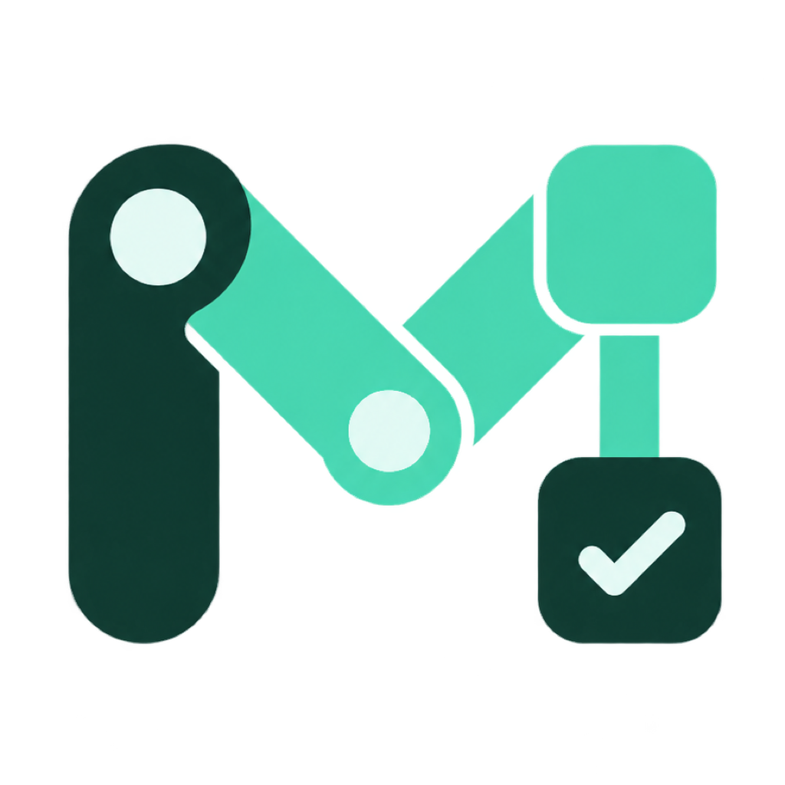

<p align="center">
  
</p>

<h1 align="center">Vibe Kit</h1>

<p align="center">Give Codex a trusted Release link and a development goal. Let the project carry the workflow.</p>

<p align="center"><strong>English</strong> · <a href="README.zh-CN.md">简体中文</a></p>

<p align="center">Current release · <a href="https://github.com/mintgao/vibe-kit/releases/tag/v0.5.0"><code>v0.5.0 Pre-release</code></a></p>

## What Vibe Kit does

Vibe Kit is a project-pinned development system for coding Agents. You describe the project and the result you want. Codex handles trusted adoption, project understanding, workflow selection, technical-decision readiness, implementation, and verification.

The working model travels with the repository, so a collaborator or a new machine can pick up the same versioned instructions and project context. Codex is the currently verified Agent host. Other coding Agents need their own adapter and conformance evidence before receiving the same compatibility claim.

## What your Agent gets

- **Safe project adoption.** Codex selects an exact trusted Release, checks its impact before writing, preserves project-owned files, and stops with a concrete recovery action when it finds a collision or incompatible state.
- **Evidence-backed project understanding.** On first substantive work, Codex inspects the repository, establishes or refreshes durable product and technical context, and then resumes the original request.
- **Automatic workflow routing.** Feature, design, implementation, debugging, and verification requests are routed to the matching workflow without requiring you to name a command, Skill, or internal role.
- **Risk-aware, verifiable delivery.** Small reversible changes stay lightweight. Durable or high-risk choices pass a technical-decision readiness gate, and completed work reports executed evidence, skipped checks, and known limitations.

## Install and use

The user-visible flow has three steps.

1. Give Codex the exact Vibe Kit Release link and your project goal.
2. Codex verifies the source, checks the planned impact, adopts the Kit, checks installation health, and establishes project context internally.
3. Continue describing development work in ordinary language.

### Add Vibe Kit to an existing project

Open the project in Codex and send this request.

> Adopt Vibe Kit from https://github.com/mintgao/vibe-kit/releases/tag/v0.5.0 into the current project. Use this exact trusted version, preserve existing application files and project documentation, complete the health check and evidence-backed project onboarding, then continue with this goal: [my development goal].

### Create a new project with Vibe Kit

Describe the application, target directory, and preferred stack in the same request.

> Create a Next.js expense-tracking app in `./my-app` with the official framework generator. Then adopt Vibe Kit from https://github.com/mintgao/vibe-kit/releases/tag/v0.5.0 into the generated project, verify the installation, establish project context, and continue implementing the first usable version.

The exact Release URL selects the current Pre-release explicitly. If you provide only the bare repository URL while no stable Release exists, Codex should ask once before selecting the Pre-release.

After adoption, requests look like normal development work.

> Add sign-in with email and document the important product decisions.

> Investigate why the home page is slow on its first load and fix the confirmed cause.

> Verify whether the current version is ready to release and show the evidence for each criterion.

Codex should report the selected version and source, installation health, project-understanding readiness, and the next action. If the host cannot reload newly installed repository instructions in the current task, the only general fallback is to open a new Codex task in the project and state the development goal normally.

## Appendix for professional developers and maintainers

Everything above is the normal user path. The rest of this page covers the implementation, trust, and maintenance boundaries behind it.

### Architecture and ownership boundaries

Vibe Kit combines a dependency-free Python CLI with repository-scoped instructions, specialist Agents, workflow Skills, and project-owned Markdown context. Release archives and the bootstrap Plugin are acquisition channels. The installed repository remains the runtime source of truth.

- **Framework-managed:** the marked Vibe block in `AGENTS.md`, `bin/vibe`, `.vibe/core/`, `.codex/agents/vibe-*`, and `.agents/skills/vibe-*`.
- **Tool-maintained:** `.vibe/manifest.json`, `.vibe/version`, and generated `.vibe/conflicts/` candidates.
- **Project-owned:** `.vibe/project.yaml`, `.vibe/project-rules.md`, `.vibe/onboarding.json`, and `docs/`. Upgrades do not overwrite these files.

See the [architecture context](docs/context/architecture.md) for the complete component and ownership model.

### CLI and health checks

These commands are Agent, maintainer, and troubleshooting interfaces. Ordinary users do not need them for daily work.

```bash
./bin/vibe doctor .
./bin/vibe verify .
./bin/vibe work-item settings-page --size M --title "Settings Page"
```

`doctor` reports installation health separately from project-understanding readiness. `verify` runs only the project commands explicitly configured in `.vibe/project.yaml`; review those commands as you would any project script.

### Trust, releases, and compatibility

The default trust contract recognizes only `https://github.com/mintgao/vibe-kit`. Exact tag and Release URLs select a specific published version, whose Release metadata and SHA-256 are checked before installation. Moving refs such as `main`, unverified archives, silent repository changes, and `curl | sh` flows are rejected.

The normative human and machine contracts are [AGENT_INSTALL.md](AGENT_INSTALL.md) and [agent-install.json](agent-install.json). Vibe Kit 0.5.0 uses core protocol 3, Codex adapter protocol 3, Agent-install protocol 1, and feedback protocol 2. The CLI requires Python 3.9 or later and uses only the standard library.

### Upgrades and conflicts

Use a newer trusted checkout, validated Release payload, or bundled Plugin payload to update an installed project. The project-local older CLI does not fetch a new version from the network.

```bash
/path/to/newer-vibe-kit/bin/vibe plan upgrade /path/to/my-app
/path/to/newer-vibe-kit/bin/vibe upgrade /path/to/my-app
```

Upgrade compares recorded, local, and incoming hashes before replacing managed files. When both the project and incoming version changed the same managed file, Vibe Kit stops before changing managed files and writes review candidates under `.vibe/conflicts/<timestamp>/`.

### Verification and release engineering

The configured repository checks are dependency-free and scenario-driven.

```bash
python3 -m unittest discover -s tests -v
./bin/vibe package --status prerelease
./bin/vibe validate-release dist/vibe-kit-0.5.0
```

Release validation checks archive safety, checksums, versions, Agent-contract identity, and drift across the direct Release, Plugin payload, and expanded marketplace. See the [v0.5.0 release notes](docs/releases/0.5.0.md) and [reproducible release decision](docs/decisions/0004-reproducible-release-contract.md).

Static contract tests confirm that the distributed instructions contain the required boundaries. Controlled Agent scenarios and independent QA are still required to observe real workflow behavior. Documentation string tests cannot replace this kind of behavioral evidence.

### Feedback and privacy

Vibe Kit does not collect telemetry or silently submit feedback. Evidence-backed Kit gaps can be stored locally and deduplicated. In `ask` mode, an exact sanitized GitHub Issue payload is shown once; submission still requires adjacent, unambiguous approval bound to that report, repository, and current review hash. `local` keeps candidates on disk without asking, while `off` disables proactive classification.

```bash
./bin/vibe feedback mode
./bin/vibe feedback list
./bin/vibe feedback review <report-id>
```

Security-sensitive candidates can remain local but cannot produce a public review hash or reach remote submission. See the [feedback-loop design](docs/work-items/20260827-proactive-feedback-loop/design.md) for the full boundary.

### Current limitations

- `v0.5.0` is a GitHub Pre-release. There is no stable Release, public Plugin Directory entry, automatic network updater, or publisher signature and provenance attestation.
- SHA-256 metadata verifies asset and manifest consistency. Publisher identity still depends on the GitHub account, commit, and tag.
- The Codex adapter is the only currently verified Agent integration. Real Linux, live task handoff, and live Plugin-host evidence remain incomplete for this Pre-release.
- Install and upgrade are not whole-directory transactions. A failure after writes begin may require repository inspection, an installed health check, and scoped Git or trusted-payload recovery.
- Technical-decision readiness is a fail-closed repository workflow contract carried by prompts, role separation, and Markdown evidence. The CLI distributes and hash-checks the contract, but it does not currently parse work-item readiness or mechanically prevent file writes.
- Adoption performs shallow stack detection. Evidence-backed onboarding performs deeper project understanding after installation.

For deeper implementation details, read the [Agent-first adoption decision](docs/decisions/0007-agent-first-adoption-contract.md), [technical-decision readiness contract](.vibe/core/technical-decision-readiness.md), and [distribution design](docs/work-items/20260827-distribution-architecture/design.md).
